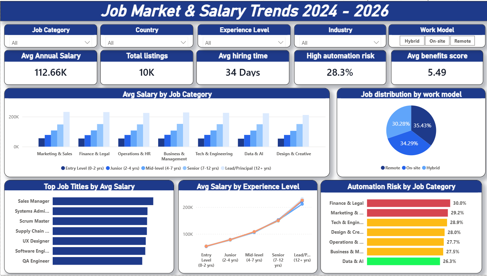

# 📊 Job Market & Salary Trends Dashboard (2024–2026)

## Overview

This project presents an interactive Power BI dashboard built to analyze the global job market using salary, hiring, work model, and automation risk data.

The dashboard helps users explore employment trends across industries, countries, experience levels, and job categories through interactive visualizations.

---

## Dashboard Preview



---

## Objectives

- Analyze salary trends across different job categories.
- Compare salaries based on experience level.
- Understand job distribution across Remote, Hybrid, and On-site work models.
- Identify industries with higher automation risk.
- Explore hiring time and employee benefits across the market.

---

## Dataset Information

- Dataset: Job Market & Salary Trends (2024–2026)
- Total Records: 10,000
- File Format: CSV
- Tool Used: Power BI Desktop

---

## Dashboard Features

### Interactive Filters

- Job Category
- Country
- Experience Level
- Industry
- Work Model

### KPI Cards

- Average Annual Salary
- Total Job Listings
- Average Hiring Time
- Automation Risk
- Average Benefits Score

### Visualizations

- Average Salary by Job Category
- Job Distribution by Work Model
- Top Job Titles by Average Salary
- Average Salary by Experience Level
- Automation Risk by Job Category

---

## Key Insights

### 💰 Salary Trends

- Lead/Principal professionals receive the highest salaries.
- Data & AI continues to offer one of the fastest salary growth rates.

### 🌍 Work Model

- Remote jobs account for approximately 35%.
- On-site jobs account for approximately 34%.
- Hybrid jobs account for approximately 30%.

### 🤖 Automation Risk

- Finance & Legal has the highest automation risk.
- Data & AI has comparatively lower automation risk.

### ⏱ Hiring Process

- Average hiring time is approximately 34 days.

---

## Tools & Technologies

- Power BI Desktop
- Power Query
- DAX
- Data Modeling
- Data Cleaning
- Data Visualization

---

## Skills Demonstrated

- Dashboard Design
- Business Intelligence
- Interactive Reporting
- Data Cleaning
- Data Transformation
- DAX Calculations
- KPI Design
- Data Storytelling

---

## Files Included

```
📁 Job-Market-Salary-Trends
│
├── Job Market & Salary Trends.pbix
├── job_market_salary_trends.csv
├── dashboard.png
├── README.md
└── LICENSE
```

---

## Future Improvements

- Forecast salary trends
- AI-powered salary prediction
- Drill-through pages
- Department-level analysis
- Country comparison page

---

## Connect With Me

LinkedIn:
www.linkedin.com/in/ritesh-pradhan

GitHub:
https://github.com/Ritesh-Pradhan-23

---

If you found this project interesting, don't forget to ⭐ the repository.
